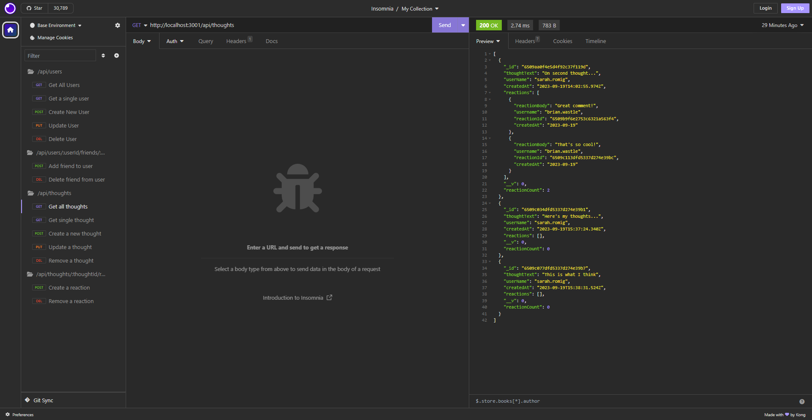

# <Social Media API>

## Description

My motivation behind creating this project was to gain hands-on experience and practical knowledge in building a robust backend system for a social networking platform. I built this project to understand the better user management, data storage, and interactions within a web application. This project aims to solve the problem of managing users, their connections (friends), and their thoughts within a social network. 

Through the development of this project, I learned essential skills related to database design, RESTful API development, and user authentication. I also gained insights into handling various types of data operations, such as CRUD operations (Create, Read, Update, Delete), and managing complex relationships between different data entities. This project has been instrumental in my journey to becoming a proficient full stack web developer.

## Installation

N/A

## Usage

Available endpoints are listed in the ```thoughtRoutes.js``` and ```userRoutes.js``` files. They can be tested in the Insomnia client and MongoDB Compass client. 

https://drive.google.com/file/d/1ex6yoIcj2q3ENATeJ9hrL5kkZ8dpjdgr/view



## Features

- Add and delete users

- Find all user info, or a single user's info

- Add and delete friends associated with each user

- Update user info

- Get thought data by single thought, or all thoughts

- Add, update or delete a new thought

- Add or delete a reaction comment to a thought
